# Momentus 🚀

[](https://github.com/FabricioLimaa/Momentus/blob/main/LICENSE.txt)
[](https://kotlinlang.org/)
[]()

**Um aplicativo Android moderno de produtividade para gerenciar seus hábitos, rotinas e eventos diários com um widget interativo e sistema de gamificação para manter você motivado.**

<br/>

---

## 📋 Índice

- [Sobre o Projeto](#-sobre-o-projeto)
- [✨ Funcionalidades Principais](#-funcionalidades-principais)
- [📸 Telas](#-telas)
- [🛠️ Tecnologias e Arquitetura](#️-tecnologias-e-arquitetura)
- [🚀 Começando](#-começando)
  - [Pré-requisitos](#pré-requisitos)
  - [Configuração](#configuração)
- [📄 Licença](#-licença)
- [👨‍💻 Autor](#-autor)

---

## 🎯 Sobre o Projeto

O **Momentus** foi projetado para ser um companheiro de produtividade inteligente. Em vez de apenas listar tarefas, ele ajuda a construir e manter rotinas consistentes, oferecendo feedback instantâneo e motivação através de um sistema de conquistas e pontos. O foco principal é a interação rápida por meio de um widget na tela inicial, permitindo que o usuário gerencie seu dia sem precisar abrir o aplicativo constantemente.

---

## ✨ Funcionalidades Principais

- **✅ Gestão de Eventos e Hábitos:** Crie, edite e organize seus eventos diários com títulos, descrições, horários e categorias personalizadas.
- **🎨 Sistema de Categorias:** Atribua cores e nomes às suas categorias para uma organização visual clara e intuitiva.
- **🔄 Templates de Rotina:** Crie modelos de rotinas (ex: "Rotina Matinal", "Foco no Trabalho") e adicione eventos a eles para agilizar o planejamento.
- **📱 Widget Interativo (Glance):** 
    - Visualize os eventos do dia diretamente na sua tela inicial.
    - Marque hábitos como concluídos com um único toque.
    - Adicione novos eventos e atualize a lista instantaneamente.
- **🏆 Gamificação e Progresso:**
    - **Sistema de Pontos e Conquistas:** Ganhe pontos e desbloqueie conquistas ao completar hábitos e manter a consistência.
    - **Sequência (Streak):** Acompanhe sua sequência de dias consecutivos de atividades para se manter engajado.
- **🔐 Autenticação Segura:** Login com Conta Google para proteger os dados do usuário.

---

## 📸 Telas

<p align="center">
  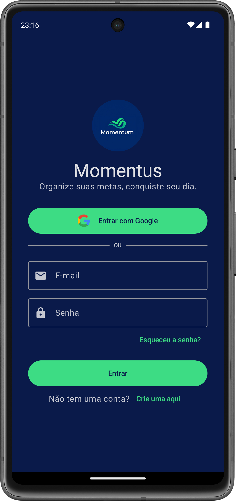
  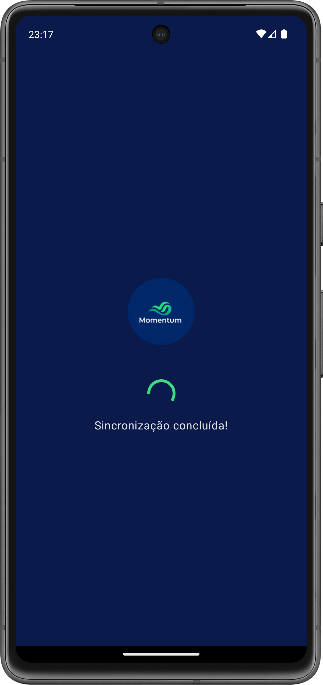
  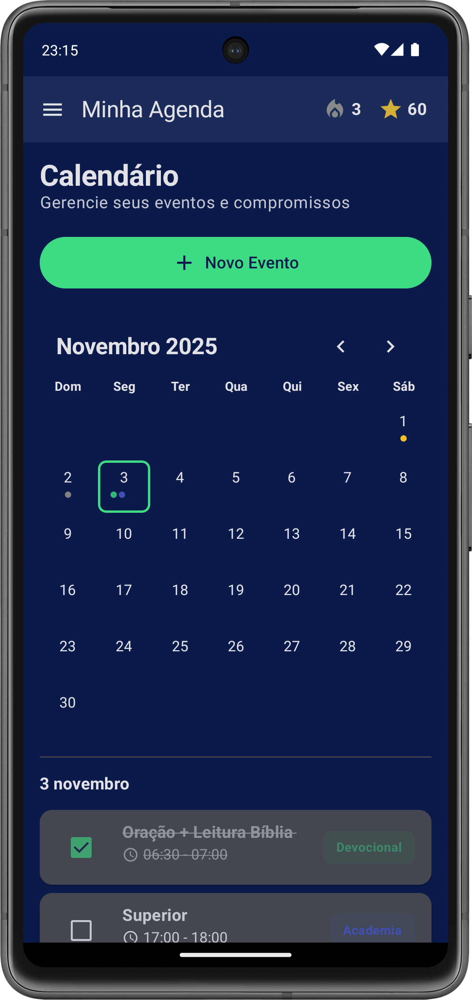
  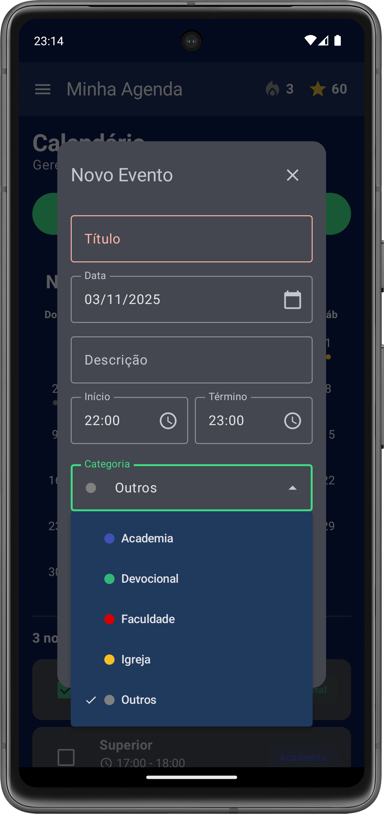
</p>
<p align="center">
  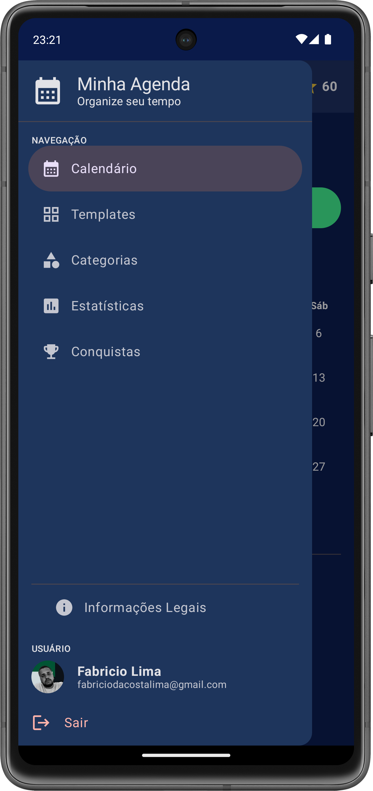
  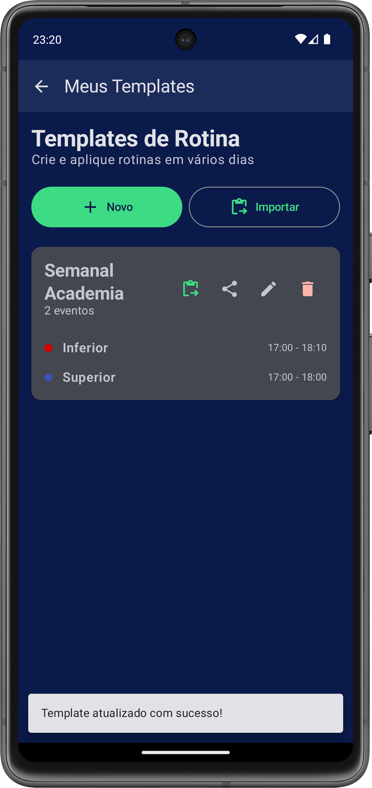
  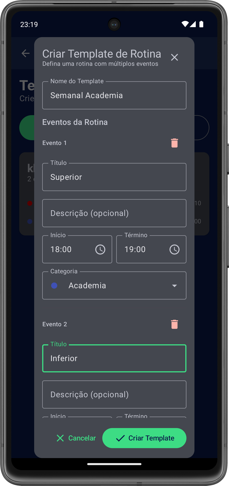
  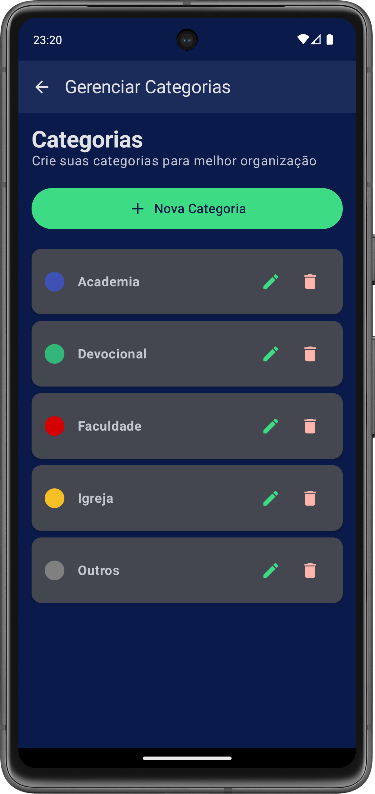
</p>
<p align="center">
  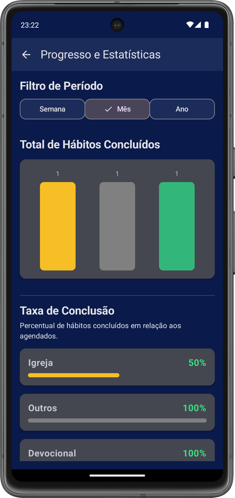
  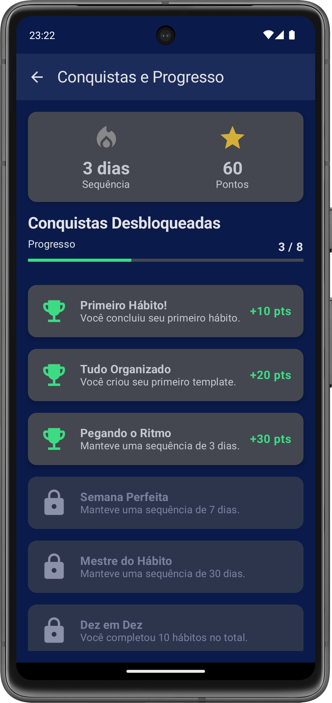
  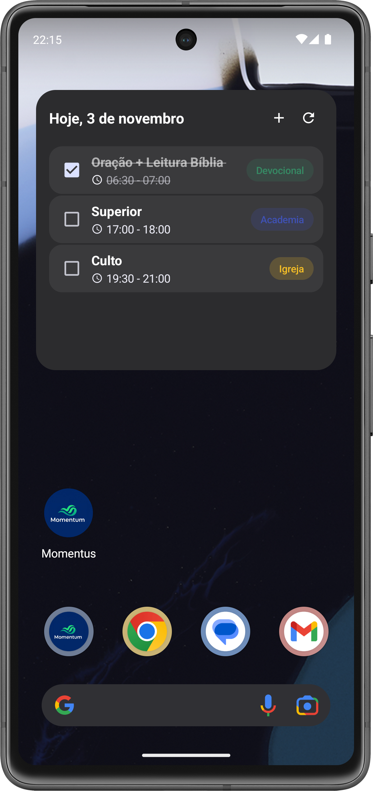
</p>

---

## 🛠️ Tecnologias e Arquitetura

Este projeto foi construído utilizando tecnologias modernas e seguindo as boas práticas de desenvolvimento Android recomendadas pelo Google.

- **Linguagem:** **[Kotlin](https://kotlinlang.org/)** (100% Kotlin-first)
- **Arquitetura:** **MVVM (Model-View-ViewModel)** com **Repository Pattern**.
  - Separação clara de responsabilidades, facilitando a manutenção e testes.
- **UI:** **Jetpack Compose** com **Material Design 3** para as telas do app e **Glance API** para o widget.
- **Componentes Principais:**
  - `ViewModel` e `StateFlow`: Para gerenciamento de estado reativo e ciclo de vida consciente.
  - `Hilt`: Para injeção de dependência em todo o app, incluindo componentes complexos como Widgets.
  - `Room`: Para persistência de dados em um banco de dados local (SQLite).
  - `DataStore`: Para salvar dados simples e preferências (como o estado do widget).
  - `Coroutines` & `Flow`: Para gerenciamento de operações assíncronas.
  - `WorkManager`: Para agendar tarefas em segundo plano confiáveis, como a atualização periódica do widget.
- **APIs e Integração:**
  - **Firebase Authentication**: Para autenticação segura e simplificada com o Google.
  - **Cloud Firestore** (Potencial): A estrutura está pronta para a integração com o Firestore para sincronização de dados na nuvem.

---

## 🚀 Começando

Para executar uma cópia local deste projeto, siga estes passos.

### Pré-requisitos

- Android Studio (versão mais recente recomendada)
- Uma Conta Google

### Configuração

1.  **Clone o repositório:**
    ```sh
    git clone https://github.com/seu-usuario/Momentus.git
    ```
2.  **Abra no Android Studio:**
    - Abra o Android Studio e selecione `Open`.
    - Navegue até a pasta que você acabou de clonar e selecione-a.
    - Aguarde o Gradle sincronizar o projeto.

3.  **Configure o Firebase:**
    - Conecte o projeto a um projeto Firebase no console.
    - Habilite o **Google** como um provedor de autenticação no Firebase Authentication.
    - Baixe o arquivo `google-services.json` do seu projeto Firebase e coloque-o na pasta `app/` do projeto Android.

4.  **Rode o Aplicativo:**
    - Clique no botão de **Play (▶)** para instalar e rodar o app em um emulador ou dispositivo físico.

---

## 📄 Licença

Este projeto é licenciado sob uma licença proprietária. Todos os direitos são reservados. Veja [`LICENSE.txt`](https://github.com/FabricioLimaa/Momentus/blob/main/LICENSE.txt) para mais informações.

---

## 👨‍💻 Autor

**Fabricio Lima**

- [LinkedIn](https://www.linkedin.com/in/fabricio-lima-s-s/)
- [GitHub](https://github.com/fabriciolimac)
